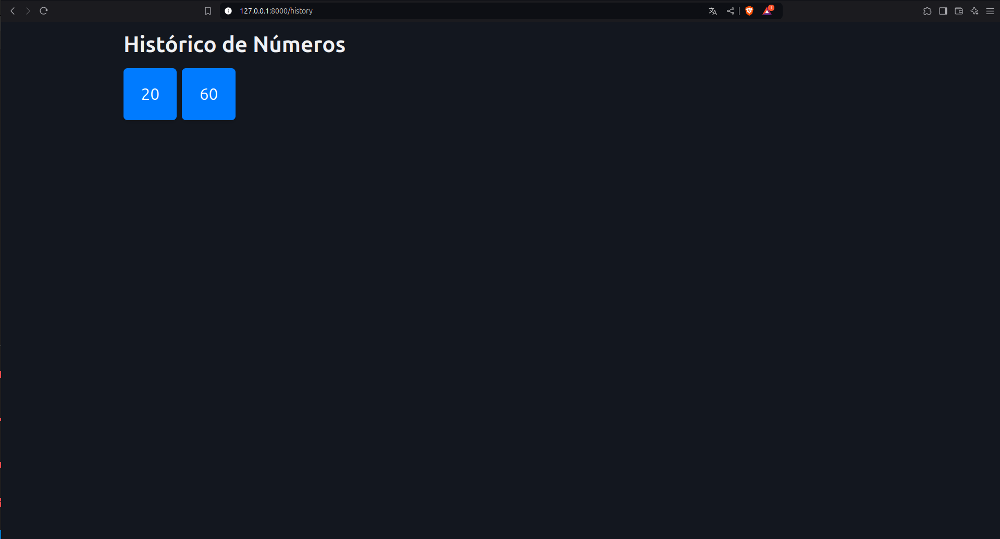

<h1 style="text-align: center;">
Bingo management APP<br>

</h1>  

This project aims to create a simple application to manage the numbers in a bingo game.  
It allows to have **multiple clients connected at the same time and getting the same information at the same time**.  
This functionality is usefull in case of projecting the numbers drawn in one device and using other to project an history of the past numbers drawn.  

## The app  
  
This app provides two main functionalities:  
* An endpoint to present the last number drawn (`http://IP:PORT/last`).  
* An endpoint to show the history of numbers drawn (`http://IP:PORT/history`)

The server allows the operator to insert or delete numbers. The information is stored in a local database (sqlite), to avoid data loss in case of application failure.


## Testing the app

Just run:  
```bash
pip install -r requirements.txt
python main.py
```  
  
## Gallery

  
  
