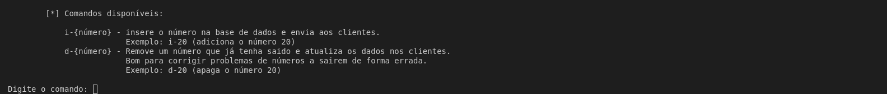

<h1 style="text-align: center;">
Bingo management APP<br>

</h1>  

This project aims to create a simple application to manage the numbers in a bingo game.  
It allows to have **multiple clients connected at the same time and getting the same information at the same time**.  
This functionality is usefull in case of projecting the numbers drawn in one device and using other to project an history of the past numbers drawn.  

## The app  
  
This app provides two main functionalities:  
* An endpoint to present the last number drawn (`http://IP:PORT/last`).  
* An endpoint to show the history of numbers drawn (`http://IP:PORT/history`)

The server allows the operator to insert or delete numbers. The information is stored in a local database (sqlite), to avoid data loss in case of application failure.  
The webpages served by the application also implement a reconnect mechanism to overcome possible network problems, which may lead to the connection loss between the clients/server.

## Configuration  

This app has a simple configuration system. All configuration is stored in the [config.py](src/config.py) file.  
A sample configuration can be analyzed bellow:  
```python

config = {
    "page":{ #all configs used in web page templates. We can have multiple pages here
        "last":{ #the /last page
           "title":"Último número", #the title that is shown in the webpage.
            "container_title":"Last number drawn", #the message that is shown in the webpage header
            "default_last_message_empty_values": "No number drawn" #the default message that is shown when no number was drawn.
        },
        "history":{ #the /history page
            "title":"History of numbers drawn", #the title that is shown in the webpage.
            "container_title":"History of numbers drawn"
        }
    },
    "message_available_commands": """
        [*] Available commands:

            i-{number} - inserts the number into the database and sends it to customers.
                         Example: i-20 (adds the number 20)
            d-{number} - Removes a number that has already gone out and updates the data in the clients.
                         Good for correcting problems with numbers going out incorrectly.
                         Example: d-20 (deletes the number 20)
        """
}
```  
> **Please note that the default configuration has the strings in portuguese!**  
You need to change those to your language.
## Testing the app

Just run:  
```bash
pip install -r requirements.txt
python main.py
```  
  
## Gallery

  
  
